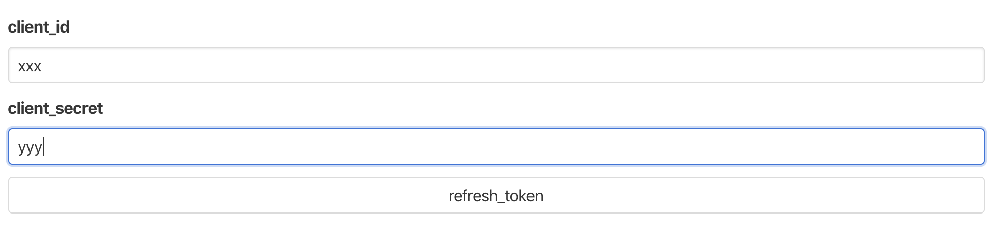
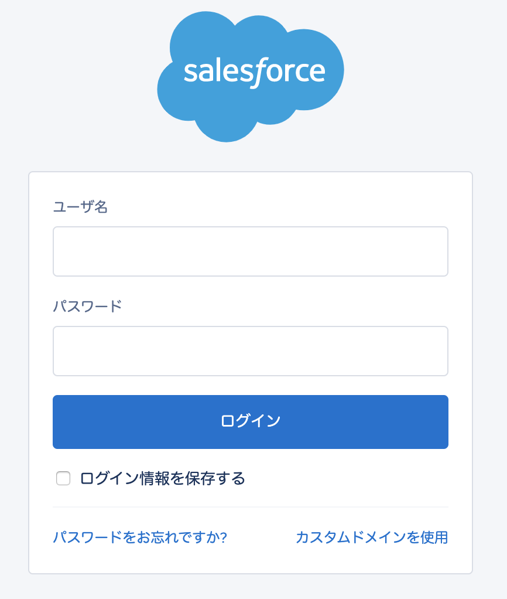
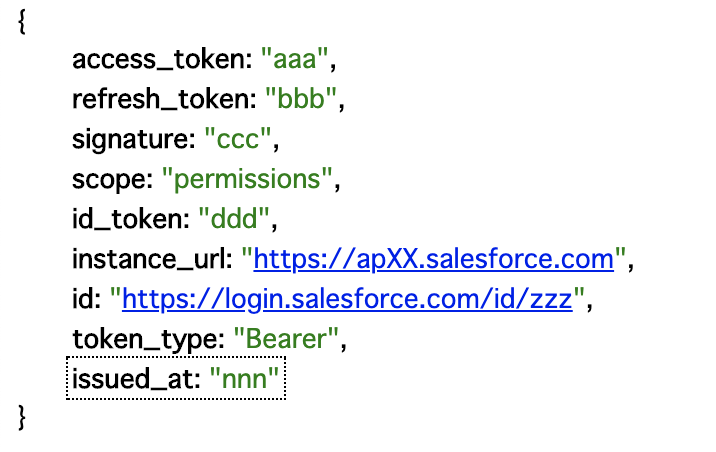

# salesforce-refresh-token

Easily get Salesforce `refresh_token`.

## How to use.

###  Set in Salesforce

Add `http://localhost:1234/` to callback url in Salesforce settings.

### Starting the server

```
% git clone https://github.com/abetomo/salesforce-refresh-token.git
% cd salesforce-refresh-token
% npm i
% npm run server
```

Access `http://localhost:1234/` in a browser.

### Get refresh_token in browser.

#### Enter client_id and client_secret



Press `refresh_token`.

#### Log in to Salesforce, check the permissions and allow.



#### Get refresh_token

Response JSON containing `refresh_token` is displayed.


